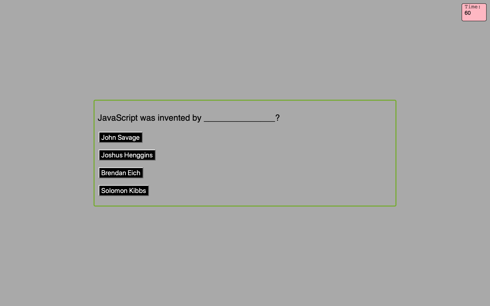

Timed Quiz

The purpose of this project is to develop a timed quiz using HTML, CSS and JavaScript.
When the user clicks on the 'start quiz' button, the are presented with the first question with multiple choces to chose from.
When they select their response, the next question will appear on  the screen.
When answer incorrectly, ten seconds is deducted from the clock.
When the timer reaches 0, the game is over. When the game is over user's initial and scores are saved in local storage.

https://github.com/meskyA/timed-quiz
https://meskya.github.io/timed-quiz/

